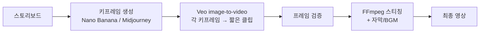

# Video Production Workflow Guide

이미지 생성 + Veo 영상 생성을 결합한 짧은 영상 제작 워크플로우.

## 모던 파이프라인



핵심 변화: 과거의 "키프레임 생성 → AI가 사이를 보간" 가정은 **Nano Banana 기능이 아닙니다**. 실제 모던 워크플로우는 **각 키프레임을 Veo로 짧은 클립화 → 스티칭**입니다.

## Phase 1: 스토리보드 → 키프레임

각 컷의 키프레임을 이미지 생성 모델로 만든다. 일관성이 중요할수록 Nano Banana Pro 권장 (레퍼런스 이미지 최대 14장 입력 가능, 인물 일관성 5명).

### 모델 선택

| 상황 | 모델 | 이유 |
|------|------|------|
| 빠른 컨셉 탐색 | NB2 (Flash) 또는 Midjourney | 비용·속도 |
| 캐릭터·브랜드 일관성 필수 | **NB Pro** | 다중 레퍼런스 입력 |
| 텍스트·로고 포함 | **NB Pro** | 텍스트 렌더링 우수 |

### 히어로 샷 체크리스트

- [ ] 명확한 주인공 식별
- [ ] 환경/배경 확립
- [ ] 조명 방향 기록 (Veo 클립화 시 일관성 중요)
- [ ] 카메라 앵글 명시
- [ ] 종횡비 통일 (Veo 출력은 보통 16:9)

## Phase 2: Veo로 키프레임 → 영상 클립

각 키프레임을 Veo image-to-video로 짧은 클립화 (기본 8초, 720p, 네이티브 오디오).

### 기본 호출 (google-genai SDK)

```python
import time
from google import genai

client = genai.Client(api_key=os.environ["GEMINI_API_KEY"])

operation = client.models.generate_videos(
    model="veo-3.1-generate-preview",  # 또는 fast/lite 변형
    prompt="Camera slowly pans right as the character turns to face the viewer",
    image=keyframe_image,  # PIL.Image 또는 SDK 이미지 객체
)

while not operation.done:
    time.sleep(10)
    operation = client.operations.get(operation)

video_bytes = operation.response.generated_videos[0].video.video_bytes
```

### 모델 선택 (Veo)

| 모델 식별자 | 초당 가격 | 용도 |
|------------|----------|------|
| `veo-3.1-generate-preview` (Standard) | $0.40/s (~₩591) | 최종 결과물 |
| Veo 3 Fast | $0.15/s (~₩222) | 중간 검증 |
| Veo 3.1 Lite | $0.05/s (~₩74) | 빠른 컨셉 확인 |

> **컨셉은 Lite로 → 최종은 Standard**가 비용 효율적. 8초 Standard ≈ ₩4,730.

### 다중 레퍼런스 (옵션)

Veo 3.1은 최대 3장의 레퍼런스 이미지로 캐릭터·환경 일관성 강화 가능. 시리즈 클립 제작 시 유용.

## Phase 3: 물리적 검증 체크리스트

Veo는 추론 모델이지만 짧은 클립에서도 오류는 발생. 각 클립 검수:

### 즉시 재생성 필요 (Critical)
- [ ] 손가락 6개 이상, 비대칭 눈
- [ ] 떠있는 물체, 그림자 방향 불일치
- [ ] 캐릭터 ID 변형 (얼굴/의상이 클립 중간에 바뀜)

### 경미 — 후처리 가능 (Minor)
- [ ] 미세한 색상·조명 변화
- [ ] 배경 디테일 변화
- [ ] 의상 주름

### 검증 우선순위
1. 캐릭터 일관성 (최우선)
2. 물리 법칙 (중력·그림자·반사)
3. 스타일 일관성 (렌더링·색상 톤)

## Phase 4: 스티칭 & 후처리

여러 8초 클립을 FFmpeg로 이어붙이고 자막·BGM 합성.

### 기본 스티칭 (FFmpeg)

```bash
# concat list 작성
echo "file 'clip1.mp4'" > list.txt
echo "file 'clip2.mp4'" >> list.txt
echo "file 'clip3.mp4'" >> list.txt

ffmpeg -f concat -safe 0 -i list.txt -c copy output.mp4
```

### 클립 길이 가이드

| 동작 타입 | Veo 클립 길이 | 비용 (Standard 기준) |
|-----------|--------------|----------------------|
| 짧은 표정·제스처 | 4초 | ₩2,365 |
| 카메라 무빙 | 8초 (기본) | ₩4,730 |
| 시퀀스 컷 | 8초 × N | N × ₩4,730 |

> **Veo는 8초 단위가 기본**. 더 긴 영상은 여러 클립 + 스티칭으로 구성.

## 트러블슈팅

### 캐릭터가 클립 중간에 변형됨
- Veo 3.1의 **레퍼런스 이미지 입력**(최대 3장) 활용
- 또는 키프레임을 NB Pro로 더 명확히 만들고 prompt에 캐릭터 디테일 명시

### 조명·색감이 클립 간 불일치
- 모든 키프레임을 같은 NB JSON 템플릿으로 생성 (`lighting`, `colorRestriction` 고정)
- 후처리 단계에서 FFmpeg color matching 적용

### 모션이 어색함
- prompt에 카메라/동작을 명시적으로 기술 ("slow pan right", "subject walks toward camera")
- Veo는 자연어 prompt에 강함, JSON보다 자연어 권장

## 실전: 5초 인사 클립

1. **키프레임 1장**: NB Pro로 캐릭터 정면 무표정 생성
2. **Veo 호출**:
   ```python
   prompt = "Character smiles warmly, raises right hand, and waves at the camera. Soft natural lighting."
   operation = client.models.generate_videos(
       model="veo-3.1-generate-preview",
       prompt=prompt,
       image=keyframe,
   )
   ```
3. **검증**: 손가락·표정 자연스러운지 확인
4. **잘라내기**: 8초 출력 → FFmpeg로 5초로 트리밍

총 비용: 키프레임 1장 (NB Pro 1K, ₩198) + Veo 8초 Standard (₩4,730) ≈ **₩4,928**

## 참고

- 첫 프로젝트는 1~3개 클립의 짧은 영상으로 시작 (비용 통제)
- 키프레임 + Veo prompt + 결과물을 한 폴더에 같이 보관 (재현성)
- Lite/Fast로 컨셉 확정 후 Standard로 최종 렌더 (비용 50~80% 절감)
- Veo MCP는 옵션이지만 **API 직접 호출이 비용 통제·후처리 통합 측면에서 유리**

## 출처

- [Generate videos with Veo 3.1 - Google AI](https://ai.google.dev/gemini-api/docs/video)
- [Veo 3.1 announcement - Google Developers Blog](https://developers.googleblog.com/introducing-veo-3-1-and-new-creative-capabilities-in-the-gemini-api/)
