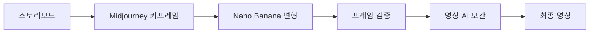

# Video Production Workflow Guide

영상 제작을 위한 AI 이미지 생성 워크플로우 가이드

## 기본 파이프라인



## Phase 1: 스토리보드 → 키프레임

### Midjourney 키프레임 생성 전략

#### 1. 스타일 통일 설정
```
Step 1: Style Creator로 일관된 스타일 코드 생성
Step 2: --sref [코드] 고정
Step 3: --seed [값] 고정 (테스트용)
Step 4: --ar 16:9 (영상 비율)
```

#### 2. 히어로 샷 체크리스트
- [ ] 명확한 주인공 식별
- [ ] 환경/배경 확립
- [ ] 조명 방향 기록
- [ ] 카메라 앵글 명시

## Phase 2: Nano Banana 변형 생성

### 일관성 유지 JSON 템플릿

```json
{
  "consistency_template": {
    "locked_elements": {
      "character": {
        "face_id": "preserve",
        "clothing": "exact",
        "body_proportions": "maintain"
      },
      "environment": {
        "location": "same",
        "time_of_day": "consistent",
        "weather": "unchanged"
      },
      "style": {
        "rendering": "match_original",
        "color_palette": "preserve",
        "texture_quality": "maintain"
      }
    },
    "variable_elements": {
      "camera": {
        "angle": ["front", "side", "back"],
        "distance": ["close", "medium", "wide"]
      },
      "action": {
        "pose": "sequence",
        "expression": "progression"
      }
    }
  }
}
```

### 변형 생성 순서

1. **카메라 각도 변형** (공간 연속성)
   ```json
   {
     "base": "hero_shot.png",
     "sequence": [
       {"camera": "0_degrees"},
       {"camera": "15_degrees"},
       {"camera": "30_degrees"},
       {"camera": "45_degrees"}
     ]
   }
   ```

2. **동작 진행** (시간 연속성)
   ```json
   {
     "action_sequence": [
       {"pose": "standing_neutral"},
       {"pose": "turning_head"},
       {"pose": "raising_hand"},
       {"pose": "waving"}
     ]
   }
   ```

3. **표정 변화** (감정 연속성)
   ```json
   {
     "expression_arc": [
       {"emotion": "neutral"},
       {"emotion": "curious"},
       {"emotion": "surprised"},
       {"emotion": "happy"}
     ]
   }
   ```

## Phase 3: 물리적 검증

### 빠른 검증 체크리스트

#### 🔴 즉시 재생성 필요 (Critical)
- [ ] 손가락 6개 이상
- [ ] 눈 위치 비대칭
- [ ] 떠있는 물체 (중력 무시)
- [ ] 그림자 방향 불일치

#### 🟡 경미한 수정 가능 (Minor)
- [ ] 미세한 색상 차이
- [ ] 배경 요소 위치 변화
- [ ] 의상 주름 변화

#### 🟢 허용 가능 (Acceptable)
- [ ] 자연스러운 머리카락 움직임
- [ ] 환경 디테일 변화
- [ ] 미세한 조명 변화

### 검증 우선순위

1. **캐릭터 일관성** (최우선)
   - 얼굴 특징
   - 신체 비율
   - 의상/액세서리

2. **물리 법칙** (필수)
   - 중력 방향
   - 그림자 일치
   - 반사 정확성

3. **스타일 일관성** (권장)
   - 렌더링 품질
   - 색상 톤
   - 텍스처 디테일

## Phase 4: 프레임 보간 준비

### 키프레임 간격 가이드

| 동작 타입 | 권장 간격 | 프레임 수 |
|-----------|----------|-----------|
| 미세 표정 | 0.5초 | 12-15 프레임 |
| 제스처 | 1초 | 24-30 프레임 |
| 걷기/이동 | 2초 | 48-60 프레임 |
| 장면 전환 | 3초 | 72-90 프레임 |

### 보간 최적화 팁

1. **앵커 포인트 설정**
   - 주요 관절 위치 마킹
   - 얼굴 특징점 고정
   - 배경 기준점 설정

2. **모션 벡터 힌트**
   ```json
   {
     "motion_hints": {
       "direction": "left_to_right",
       "speed": "moderate",
       "acceleration": "ease_in_out"
     }
   }
   ```

## 트러블슈팅

### 문제: 캐릭터 얼굴이 계속 변함

**해결책:**
```json
{
  "face_lock": {
    "method": "facial_embedding",
    "strength": 0.95,
    "reference": "hero_face.png"
  }
}
```

### 문제: 조명이 일치하지 않음

**해결책:**
```json
{
  "lighting": {
    "source": "fixed_position",
    "angle": "45_degrees",
    "color_temperature": "5600K",
    "intensity": "maintain"
  }
}
```

### 문제: 스타일이 점점 변함

**해결책:**
- Midjourney: `--sref` 코드 매번 적용
- Nano Banana: 첫 이미지의 스타일 파라미터 고정

## 실전 워크플로우 예시

### 5초 클립 제작 (캐릭터 인사)

1. **스토리보드** (3 키프레임)
   - Frame 1: 정면, 무표정
   - Frame 2: 손 들기 시작
   - Frame 3: 웃으며 손 흔들기

2. **Midjourney 생성**
   ```
   Frame 1: character standing, neutral face, front view --sref xyz --seed 123
   Frame 3: character waving, smiling, front view --sref xyz --seed 456
   ```

3. **Nano Banana 중간 프레임**
   ```json
   {
     "interpolate": {
       "from": "frame1.png",
       "to": "frame3.png",
       "steps": 5
     }
   }
   ```

4. **검증 & 수정**
   - 각 프레임 물리 검증
   - 일관성 점수 확인
   - 필요시 Vary Region

5. **영상 AI 보간**
   - 24fps 설정
   - 총 120 프레임 생성

## 체크리스트 템플릿

```markdown
## 프로젝트: [프로젝트명]
## 장면: [장면 번호]

### 키프레임 생성
- [ ] 스타일 코드: _______
- [ ] 시드 값: _______
- [ ] 비율: _______

### 일관성 체크
- [ ] 캐릭터 ID 일치
- [ ] 환경 연속성
- [ ] 조명 일관성

### 물리 검증
- [ ] 해부학 정확성
- [ ] 중력/물리 법칙
- [ ] 그림자/반사

### 보간 준비
- [ ] 키프레임 정렬
- [ ] 모션 방향 설정
- [ ] 타이밍 조정

### 최종 확인
- [ ] 해상도: 1920x1080
- [ ] 프레임레이트: 24/30fps
- [ ] 색공간: sRGB
```

## 참고 사항

- 첫 프로젝트는 3-5초 짧은 클립으로 시작
- 각 단계별 백업 필수
- 스타일/시드 코드 문서화
- 실패한 시도도 기록 (학습용)